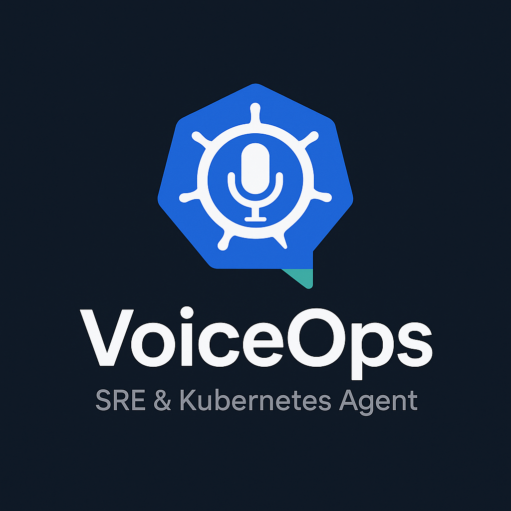
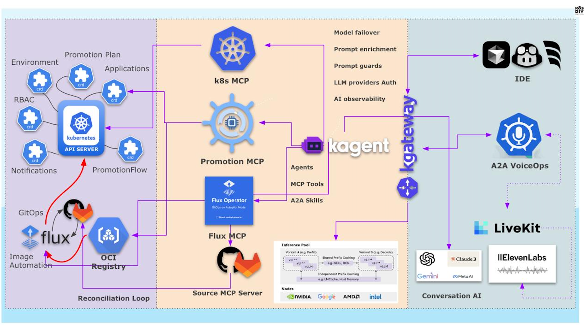
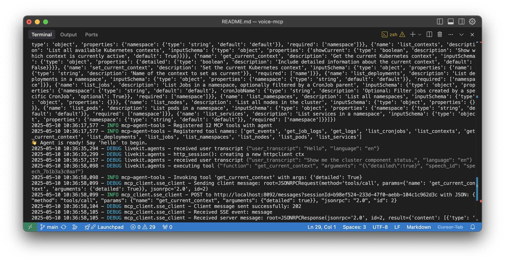

<p align="center">
  
</p>

# VoiceOps: SRE & Kubernetes Agent with MCP/A2A Tools and Skills
<p align="center">
  
</p>

A conversational AI agent and voice assistant application built with the LiveKit Agents framework, capable of using Model Context Protocol (MCP) tools to interact with external services for SRE and Kubernetes operations.

[▶️ Watch a quick usage demo](https://youtube.com/shorts/3cU2NpGXqRk)

---

## Table of Contents

- [Features](#features)
- [Quick Start](#quick-start)
- [Example: Running a Sample MCP Server](#example-running-a-sample-mcp-server)
- [Sample Prompts](#sample-prompts)
- [Prerequisites](#prerequisites)
- [Configuration](#configuration)
  - [MCP Servers](#mcp-servers)
- [Project Structure](#project-structure)
- [Testing](#testing)
- [Troubleshooting](#troubleshooting)
- [Contributing](#contributing)
- [Acknowledgements](#acknowledgements)
- [Getting Started with Kagent Integration](#getting-started-with-kagent-integration)

---

## Features

- Voice-based interaction with an AI assistant
- Integration with MCP tools from multiple external servers (flexible config)
- Speech-to-text (OpenAI Whisper)
- Natural language processing (OpenAI GPT-4o)
- Text-to-speech (ElevenLabs)
- Voice activity detection (Silero)
- **Note:** This agent currently supports only HTTP/SSE MCP servers. NPX/subprocess-based MCP server support will be added in the future.

**⚠️ WARNING: Use Caution with Real Kubernetes Clusters**

This agent can create, modify, and delete resources in your Kubernetes cluster. Always review your configuration and tool restrictions before connecting to a production or sensitive environment. Test in a safe environment first.

<p align="center">
  
</p>


## Quick Start

1. **Create and activate a Python virtual environment:**
   ```sh
   make venv
   source venv/bin/activate
   ```
2. **Install dependencies:**
   ```sh
   make uv  # (optional, for fast installs)
   make install
   ```
3. **Set environment variables:**
   ```sh
   export OPENAI_API_KEY=your_openai_api_key
   export ELEVEN_API_KEY=your_elevenlabs_api_key
   ```
4. [**Configure MCP servers**](#mcp-servers) in `mcp_servers.yaml` (see below for details).
5. **Run tests:**
   ```sh
   make test
   ```
6. **Run the agent:**
   ```sh
   make run
   ```
7. 👋 Agent is ready! Say 'hello' to begin.


## Example: Running a Sample MCP Server
### [mcp-server-kubernetes official repo](https://github.com/Flux159/mcp-server-kubernetes)

To run a sample MCP server that only allows non-destructive tools, use the following command:

```sh
ALLOW_ONLY_NON_DESTRUCTIVE_TOOLS=true ENABLE_UNSAFE_SSE_TRANSPORT=1 PORT=8092 npx mcp-server-kubernetes
```

- `ALLOW_ONLY_NON_DESTRUCTIVE_TOOLS=true` restricts the server to non-destructive tools only.
- `ENABLE_UNSAFE_SSE_TRANSPORT=1` enables SSE transport for local testing.
- `PORT=8092` sets the server port.

You can then point your agent's `mcp_servers.yaml` to `http://localhost:8092/sse`.

### Using Supergateway for stdio-based MCP Servers

[Supergateway](https://github.com/supercorp-ai/supergateway) allows you to expose stdio-based MCP servers over SSE or WebSockets. This is useful for tools like kubectl-ai that only support stdio interfaces e.g. for kubectl-ai MCP agent (https://github.com/GoogleCloudPlatform/kubectl-ai)

To run kubectl-ai as an MCP server via Supergateway:

```sh
npx -y supergateway --stdio "kubectl-ai --llm-provider=openai --model=gpt-4.1 --mcp-server" --messagePath / --port 8008
```

Then add this to your `mcp_servers.yaml`:

```yaml
servers:
  - name: kubectl-ai-mcp
    url: http://localhost:8008/sse
```

Supergateway creates an HTTP server that:
- Listens for SSE connections at `http://localhost:8008/sse`
- Forwards messages to the stdio-based MCP server
- Returns responses back to clients


## Sample Prompts

Try these example prompts with your agent:

- **Show all resources in a namespace:**
  > show me all resources in default namespace

- **List all pods:**
  > list pods in dev namespace

- **Describe a pod:**
  > describe pod my-app-123 in default namespace

- **Get recent events:**
  > get events from the prod namespace

- **Scale a deployment:**
  > scale deployment my-app to 3 replicas in dev

- **Get logs from a job:**
  > get logs from job backup-job in default namespace

- **List all deployments:**
  > list deployments in prod

## Prerequisites

- Python 3.9+
- API keys for OpenAI and ElevenLabs
- At least one MCP server endpoint
- **npx (Node.js)** is required to run the sample MCP server. If you don't have npx, install Node.js from [nodejs.org](https://nodejs.org/).

  **OS-specific tips:**
  - **macOS:** You can also install Node.js with Homebrew: `brew install node`
  - **Linux:** Use your package manager (e.g. `sudo apt install nodejs npm` for Ubuntu/Debian) or download from [nodejs.org](https://nodejs.org/).
  - **Windows:** Download the installer from [nodejs.org](https://nodejs.org/) and follow the setup instructions.

## Configuration

### MCP Servers

Edit `mcp_servers.yaml` in the project root. Example:

```yaml
servers:
  # Example: Allow only non-destructive list and describe tools from a local Kubernetes MCP server
  - name: k8s-mcp-server
    url: http://localhost:8092/sse
    allowed_tools:
      - list_*           # allow all list tools
      - describe_*       # allow all describe tools
      - get_*            # allow all get tools
```
The agent connects to the specified LiveKit room and loads all MCP servers/tools from your config.

### Authentication

The agent supports HMAC authentication for MCP servers that require it. To configure authentication:

1. Add an `auth` section to your server configuration in `mcp_servers.yaml`:

```yaml
servers:
  - name: secure-mcp-server
    url: https://example.com/sse
    allowed_tools: [*_*]
    auth:
      type: secret_key
      env_var: MY_SECRET_KEY
```

2. Set the environment variable specified in `env_var`:

```sh
export MY_SECRET_KEY=your_secret_key_here
```

The authentication system:
- Supports HMAC-SHA256 signatures
- Automatically handles base64-encoded keys
- Signs each request with the provided secret key
- Adds the signature as an `auth` parameter in the request

For MCP servers that use different authentication methods, you can modify the `auth.py` file or extend the authentication middleware.

### A2A Agent Integration

The agent supports connecting to A2A (Agent-to-Agent) servers, allowing you to use skills from other AI agents as tools. This is useful for integrating with external AI services or custom agents that expose their own skills.

To add an A2A agent, use the `type: a2a` field in your `mcp_servers.yaml`:

```yaml
servers:
  - name: my-a2a-agent
    type: a2a
    url: https://my-a2a-agent.example.com
    allowed_tools: [*]  # (optional) restrict which skills are available
    headers:
      Authorization: Bearer <token>  # (optional) custom headers for auth
```

- `type: a2a` tells the agent to treat this server as an A2A agent, not a standard MCP server.
- The agent will automatically discover available skills from the A2A agent's `/\.well-known/agent.json` endpoint.
- Each skill is exposed as a callable tool. You can invoke these skills by natural language or by specifying the tool name.
- You can use `allowed_tools` to restrict which skills are available to the agent.

**Use cases:**
- Integrate with external LLM agents, chatbots, or custom AI services that expose skills via the A2A protocol.
- Chain together multiple agents, each with specialized capabilities.

See the [A2A protocol documentation](https://github.com/modelcontextprotocol) for more details on how to implement your own A2A agent.


## Getting Started with Kagent Integration

VoiceOps can be integrated with [Kagent](https://kagent.dev/), an open-source framework for running agentic AI in Kubernetes environments. Kagent enables DevOps and platform engineers to automate complex operations, troubleshoot issues, and manage cloud-native resources using AI agents.

### Why Integrate with Kagent?
- **Unified AI Operations:** Leverage Kagent's built-in tools for Kubernetes, Prometheus, Istio, Argo, Helm, and more.
- **Autonomous Agents:** Run agents that plan, execute, and analyze operational tasks in your cluster.
- **Extensible Framework:** Easily extend with custom tools and agents for your specific workflows.

### Basic Integration Steps
1. **Deploy Kagent in your Kubernetes cluster:**
   - Follow the [Kagent documentation](https://kagent.dev/) for installation instructions.
2. **Configure Kagent as an A2A server:**
   - In your `mcp_servers.yaml`, add your Kagent A2A server endpoint:
    ```yaml
        - name: k8s-a2a-agent
          type: a2a
          url: http://a2a.mockee.me/api/a2a/kagent/k8s-agent
    ```
3. **Start VoiceOps:**
   - Run VoiceOps as usual. The agent will now be able to use Kagent's tools for cloud-native operations.

### Example Use Cases
- Diagnose application connectivity and performance issues
- Automate traffic management and alerting
- Run intelligent troubleshooting and remediation tasks

For more details, visit the [Kagent website](https://kagent.dev/) and explore the documentation and community resources.

## Project Structure

- `main.py`: Entry point for running the agent
- `agent_core.py`: Core agent logic and orchestration
- `tool_integration.py`: Integration layer for MCP tools
- `a2a.py`: Agent-to-Agent (A2A) protocol support
- `mcp_config.py`: MCP server configuration loader and utilities
- `test_agent_config.py`: Unit tests for agent configuration
- `mcp_servers.yaml`: MCP server and tool configuration file
- `Makefile`: Common development and setup commands
- `system_prompt.txt`: System prompt and instructions for the agent
- `example/`: Example scripts for A2A client/server
  - `a2a-client.py`: Example A2A client script
  - `a2a-server.py`: Example A2A server script
- `mcp_client/`: MCP client integration package
  - `__init__.py`: Package initializer
  - `agent_tools.py`: MCP tool definitions and logic
  - `auth.py`: Authentication middleware for MCP servers
  - `server.py`: MCP server connection handlers
  - `sse_client.py`: SSE client for MCP communication
  - `util.py`: MCP client utilities

## Testing

Run unit tests:

```sh
   make test
```

## Troubleshooting

### SSL Certificate Errors (CERTIFICATE_VERIFY_FAILED)

If you see an error like:

```
aiohttp.client_exceptions.ClientConnectorCertificateError: Cannot connect to host api.elevenlabs.io:443 ssl:True [SSLCertVerificationError: (1, '[SSL: CERTIFICATE_VERIFY_FAILED] certificate verify failed: unable to get local issuer certificate (_ssl.c:1006)')]
```

#### macOS:
- Run the Install Certificates script for your Python version

```sh
make certs-macos
```

#### Linux:
- Ensure `ca-certificates` is installed and updated.

```sh
make certs-linux
```

#### Virtual environments:
- Create the venv with a Python that has access to system certificates.

**Do NOT disable SSL verification in production.**

### Schema Validation Errors with LLM or MCP Tools

If you encounter errors such as `invalid_function_parameters`, `Invalid schema for function`, or similar messages from the LLM or MCP server, it usually means your tool schema is not valid or not compatible with the LLM's requirements.

- Double-check your tool's JSON schema in `mcp_servers.yaml` or your MCP server configuration.
- Ensure all required fields, types, and nested schemas are correct and follow the [JSON Schema specification](https://json-schema.org/).
- For OpenAI function calling, see [OpenAI Function Calling docs](https://platform.openai.com/docs/guides/function-calling).
- Refer to the official documentation of the MCP server you are using for the correct schema format and requirements.

## Contributing

Contributions, feedback, and ideas are welcome!

### How to Contribute

1. **Fork the repository** on GitHub.
2. **Clone your fork** to your local machine:
   ```sh
   git clone https://github.com/your-username/voice-mcp.git
   cd voice-mcp
   ```
3. **Create a new branch** for your feature or fix:
   ```sh
   git checkout -b my-feature-branch
   ```
4. **Make your changes** and add tests if applicable.
5. **Commit your changes**:
   ```sh
   git add .
   git commit -m "Describe your change"
   ```
6. **Push to your fork**:
   ```sh
   git push origin my-feature-branch
   ```
7. **Open a Pull Request** on GitHub, describing your changes and why they should be merged.
8. **Discuss and address feedback** from maintainers or other contributors.

For major changes, please open an issue first to discuss what you would like to change.

Make sure to follow best practices and keep the codebase clean and well-documented.

Let's build something great together!


## Acknowledgements
- DeepLearning.AI short course [Building AI Voice Agents for Production](https://www.deeplearning.ai/short-courses/building-ai-voice-agents-for-production/)
- [LiveKit](https://livekit.io/)
- [OpenAI](https://openai.com/)
- [ElevenLabs](https://elevenlabs.io/)
- [Silero](https://github.com/snakers4/silero-vad)
- [Kubernetes](https://kubernetes.io/) and the broader CNCF ecosystem
- [httpx](https://www.python-httpx.org/) and [anyio](https://anyio.readthedocs.io/en/stable/)
- The Python, Node.js, and open source communities
- All contributors, testers, and users who help improve this project
- Inspiration from the [Model Context Protocol (MCP)](https://github.com/modelcontext/protocol) and related projects
- **This project was created in the spirit of Vibe Coding - when human creativity, collaboration, and a  personal passion come together with AI to create something amazing.**

## License

This project is licensed under the [MIT License](LICENSE).
